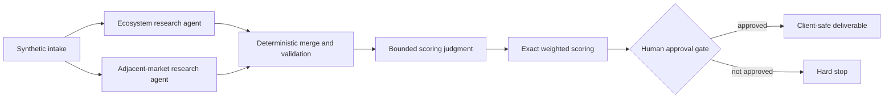

# Strategic Buyer Agent Demo

[](https://github.com/walterchen24/strategic-buyer-agent-demo/actions/workflows/ci.yml)

A credential-free demonstration of a human-governed, multi-agent GTM research pipeline. Bounded research agents produce contract-shaped JSON; deterministic code merges, scores, validates, pauses for human review, and creates a client-safe deliverable.

This repository uses fictional companies and reserved `.example` domains. It contains no production credentials, client records, contact data, campaign history, or live integration identifiers.

## See the system in 90 seconds

Run the pipeline to its mandatory approval gate:

```bash
python3 demo.py --output demo_output
```

The run stops after creating `demo_output/gate_review.json`. Review that artifact, then explicitly approve the synthetic candidates:

```bash
python3 demo.py --output demo_output --approve
```

The approved run creates:

- `sourcing_buyers.json`: deduplicated results from bounded research agents
- `scored_buyers.json`: deterministic weighted scoring and tiers
- `gate_review.json`: the human decision boundary
- `deliverable.json` and `deliverable.csv`: client-safe output with internal scoring removed
- `manifest.json`: stage state and artifact lineage

A completed deterministic run is committed in [`examples/completed_demo`](examples/completed_demo).

### Result at a glance

| Signal | Synthetic run |
|---|---:|
| Raw candidates from two agents | 4 |
| Candidates after deterministic deduplication | 3 |
| Weighted composites calculated by code | 3 |
| Candidates crossing the client-safe delivery threshold | 2 |
| Human approval required before delivery | Yes |

## Architecture



The demo replays synthetic agent outputs so anyone can inspect and run it without an API key. In the production architecture, context-isolated agents perform the bounded research and judgment steps; deterministic code owns data contracts, deduplication, exact arithmetic, validation, gates, and delivery.

The production system's broader lifecycle and the demo's deliberate boundary are documented in [`docs/production-architecture.md`](docs/production-architecture.md).

## What this demonstrates

- **Bounded agent skills:** each agent has a narrow scope, required evidence, and a JSON output contract.
- **Resumable state:** every stage writes an artifact that can be inspected independently.
- **Human governance:** delivery cannot run until the operator supplies explicit approval.
- **Deterministic mechanics:** merging and weighted scoring do not depend on model arithmetic.
- **Data minimization:** internal scores and agent metadata never cross the deliverable boundary.
- **Failure containment:** malformed, duplicate, missing, or out-of-contract records fail before downstream work.

## Repository map

```text
agents/                  bounded agent instructions and contracts
fixtures/                fictional intake and replayable agent outputs
scripts/pipeline_core.py deterministic merge, score, gate, and delivery logic
tests/                   contract, gate, scoring, and end-to-end tests
examples/completed_demo/ committed output from an approved synthetic run
demo.py                  one-command entry point
pipeline.json            canonical stage order and ownership
```

## Validate

```bash
python3 -m unittest discover -s tests -v
python3 scripts/security_scan.py .
```

The project uses only the Python standard library.

## Authorship

Walter Chen designed the system architecture, stage decomposition, contracts, approval boundaries, and operating rules. Implementation was completed with AI-assisted coding tools and reviewed through deterministic tests and artifact inspection.
